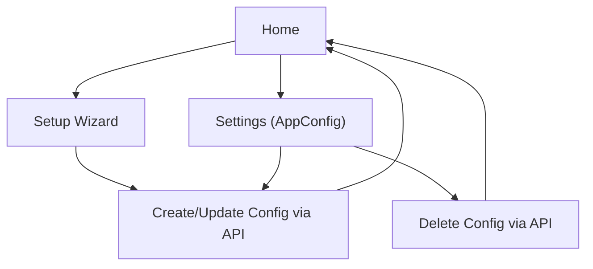

## 1. Product Overview

Provide a guided SetupWizard UI to create and maintain an `AppConfig` stored in `config.json`, backed by a simple CRUD API route.
It helps you reliably bootstrap required configuration and safely edit it later.

## 2. Core Features

### 2.1 User Roles

| Role       | Registration Method | Core Permissions                                           |
| ---------- | ------------------- | ---------------------------------------------------------- |
| Local User | None                | Can run SetupWizard, read/update/delete config.json via UI |

### 2.2 Feature Module

Our requirements consist of the following main pages:

1. **Home**: config status summary, entry points to SetupWizard and Settings.
2. **Setup Wizard**: multi-step guided configuration, validation, final save.
3. **Settings (AppConfig)**: view/edit current config, save updates, delete/reset config.

### 2.3 Page Details

| Page Name            | Module Name          | Feature description                                                                                                             |
| -------------------- | -------------------- | ------------------------------------------------------------------------------------------------------------------------------- |
| Home                 | Config status        | Show whether `config.json` exists, last updated time (if available), and current validation state (valid/invalid/unknown).      |
| Home                 | Primary actions      | Navigate to “Run Setup Wizard” (create/update) and “Settings” (edit/delete).                                                    |
| Setup Wizard         | Stepper framework    | Guide you through a fixed sequence of steps with Back/Next, step completion state, and preventing progression on invalid input. |
| Setup Wizard         | AppConfig form steps | Capture required `AppConfig` fields per step; keep a single in-memory `AppConfig` draft across steps.                           |
| Setup Wizard         | Validation           | Validate current step inputs and full `AppConfig` before final save; display field-level errors and a step-level summary.       |
| Setup Wizard         | Save & completion    | On final step, call config API to create (if missing) or replace/update (if existing); show success/failure and next actions.   |
| Settings (AppConfig) | Read current config  | Load `AppConfig` from API on page entry; show loading/empty states when missing.                                                |
| Settings (AppConfig) | Edit & save          | Edit `AppConfig` (form or structured fields) and persist updates via API; show inline errors and save state.                    |
| Settings (AppConfig) | Delete/reset         | Delete `config.json` (or reset to defaults if supported by API) and return you to Home with updated status.                     |

## 3. Core Process

**Primary flow (first-time setup)**

1. You open Home and see config status as “missing.”
2. You start Setup Wizard.
3. You complete each step; Next is disabled until required fields are valid.
4. You review the generated `AppConfig` summary.
5. You click Finish; the UI creates `config.json` through the API.
6. You return to Home and see status as “present” (and valid if validation passes).

**Update flow (existing config)**

1. You open Home and see config as “present.”
2. You go to Settings to edit, or rerun Setup Wizard to reconfigure.
3. You save; the UI updates `config.json` through the API.

**Delete flow**

1. You open Settings.
2. You choose Delete config, confirm, and the UI removes `config.json` through the API.
3. You return to Home and see config status as “missing.”

