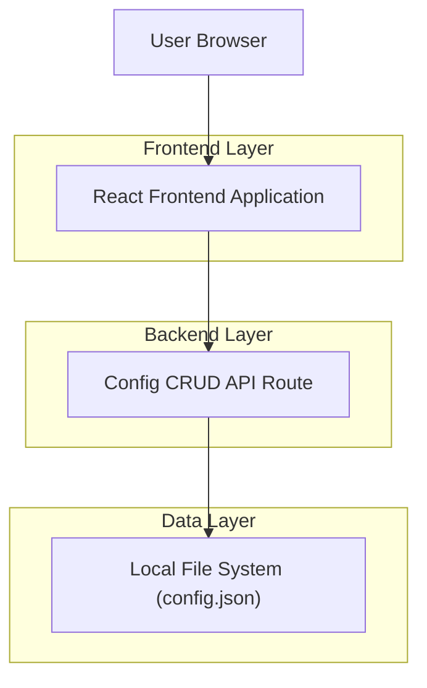
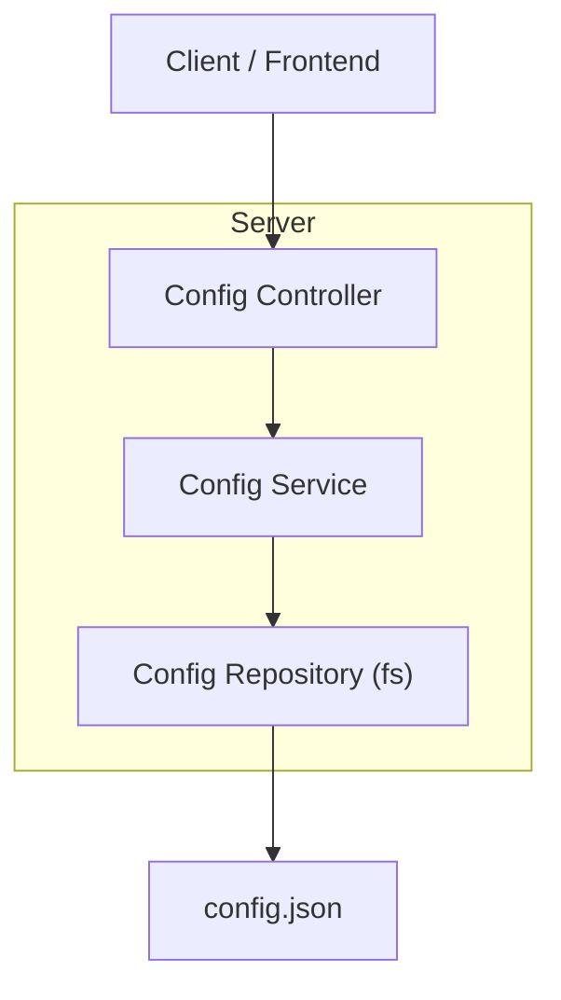

## 1.Architecture design


## 2.Technology Description
- Frontend: React@18 + TypeScript + react-router + fetch/axios
- Backend: Node.js + Express@4 (or equivalent server providing API routes)

## 3.Route definitions
| Route | Purpose |
|-------|---------|
| / | Home page, shows config status and entry points |
| /setup | SetupWizard, multi-step guided creation/update of AppConfig |
| /settings | Settings page, edit/delete AppConfig |

## 4.API definitions (If it includes backend services)

### 4.1 Shared types (TypeScript)
```ts
export type AppConfig = {
  // A version allows future migrations without breaking older config files
  version: number;
  // Your product-specific settings live here
  // Keep this typed as you formalize requirements
  settings: Record<string, unknown>;
};

export type ApiError = {
  code:
    | "CONFIG_NOT_FOUND"
    | "CONFIG_ALREADY_EXISTS"
    | "VALIDATION_ERROR"
    | "CONFLICT"
    | "IO_ERROR";
  message: string;
  details?: unknown;
};

export type ConfigReadResponse = {
  config: AppConfig;
  // For optimistic concurrency (recommended)
  etag?: string;
  updatedAt?: string;
};
```

### 4.2 Core config.json CRUD API contracts
Base URL: `/api/config`

#### GET /api/config
Purpose: Read existing config.

Response (200):
```json
{ "config": { "version": 1, "settings": {} }, "etag": "...", "updatedAt": "2026-02-13T12:00:00Z" }
```
Errors:
- 404 `CONFIG_NOT_FOUND`

#### POST /api/config
Purpose: Create config when it does not exist.

Request:
```json
{ "config": { "version": 1, "settings": {} } }
```
Response:
- 201 with `ConfigReadResponse`

Errors:
- 409 `CONFIG_ALREADY_EXISTS`
- 400 `VALIDATION_ERROR`

#### PUT /api/config
Purpose: Replace config (full update).

Headers (recommended):
- `If-Match: <etag>` (optional but recommended)

Request:
```json
{ "config": { "version": 1, "settings": {} } }
```
Response:
- 200 with `ConfigReadResponse`

Errors:
- 404 `CONFIG_NOT_FOUND`
- 400 `VALIDATION_ERROR`
- 409 `CONFLICT` (etag mismatch)

#### PATCH /api/config
Purpose: Partial update.

Option A (recommended): JSON Merge Patch (RFC 7396-style)
- Content-Type: `application/merge-patch+json`

Request example:
```json
{ "settings": { "someKey": "newValue" } }
```

Response:
- 200 with `ConfigReadResponse`

Errors:
- 404 `CONFIG_NOT_FOUND`
- 400 `VALIDATION_ERROR`
- 409 `CONFLICT` (etag mismatch, if used)

#### DELETE /api/config
Purpose: Delete config.json.

Response:
- 204 (no content)

Errors:
- 404 `CONFIG_NOT_FOUND`

### 4.3 SetupWizard step flow (frontend ↔ API)
- On entering `/setup`, call `GET /api/config`.
  - If 200: prefill wizard state with existing `AppConfig`.
  - If 404: start with a default draft `AppConfig`.
- During steps: validate locally; do not call API until final save (keeps UX fast).
- On Finish:
  - If config existed: call `PUT /api/config` (include `If-Match` when available).
  - If config did not exist: call `POST /api/config`.
- On Settings save:
  - Prefer `PATCH /api/config` for small edits or `PUT /api/config` for full replace.

## 5.Server architecture diagram (If it includes backend services)


## 6.Data model(if applicable)
Not applicable (file-based `config.json`).
